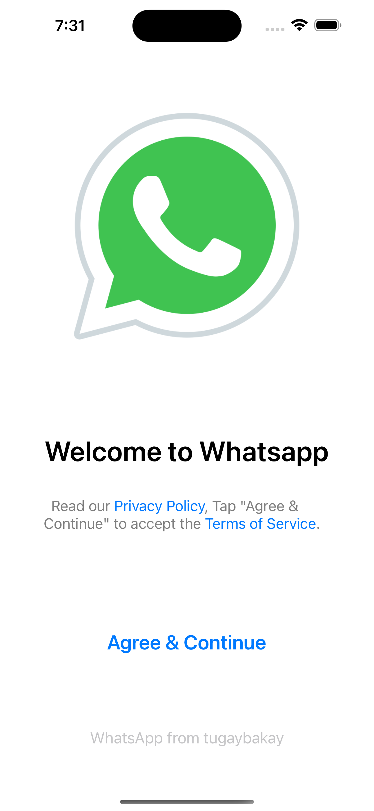
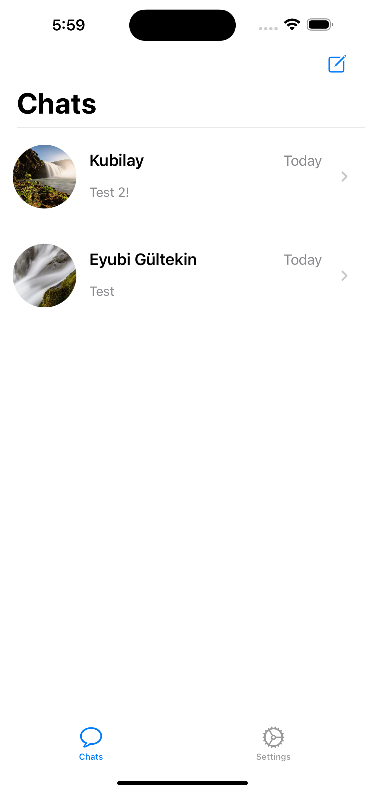
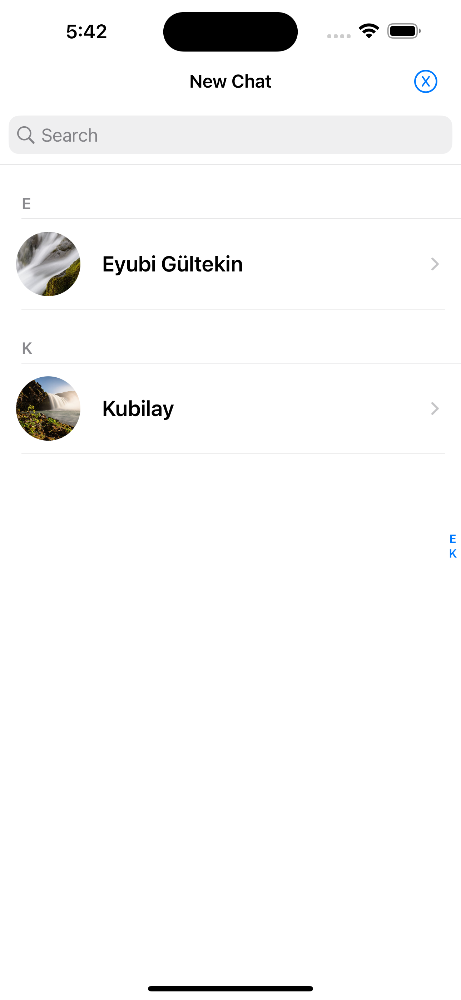
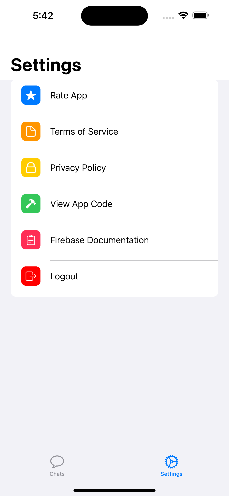
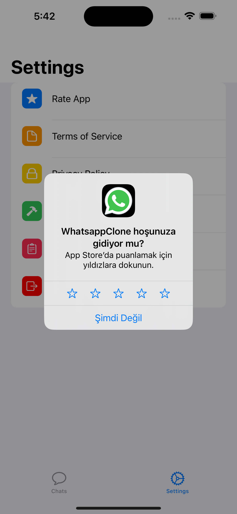
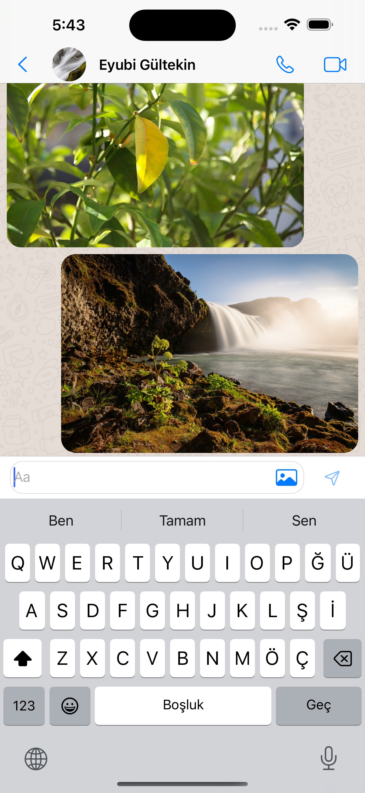

#### A realtime Chat Application made using UIkit / NO STORYBOARD!.

## Overview 💬
- This app can be used for realtime one to one chatting
- data is stored in firebase database and local coredata.
- Supports sharing of images as well.

## Screenshots 📷
  
   
  
 

 
## Includes
- Combine Framework
- Firebase Auth + Database + FireStore
- Custom Modifiers
- Animations
- Image picker
- MVVM Design Pattern
- CoreData
- SwiftUI

## Usage

To run the app, follow these steps:

1. Clone the repository.
2. Open the project in Xcode.
3. Build and run the app on the simulator or a physical device.

## Contributions

Contributions are welcome! If you find any issues or would like to add new features to the app, feel free to open an issue or submit a pull request.

## License

This project is licensed under the [MIT License](LICENSE).

---

Enjoy searching for your favorite Rick and Morty characters using this app! If you have any questions or feedback, please let me know.
